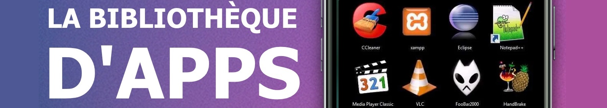
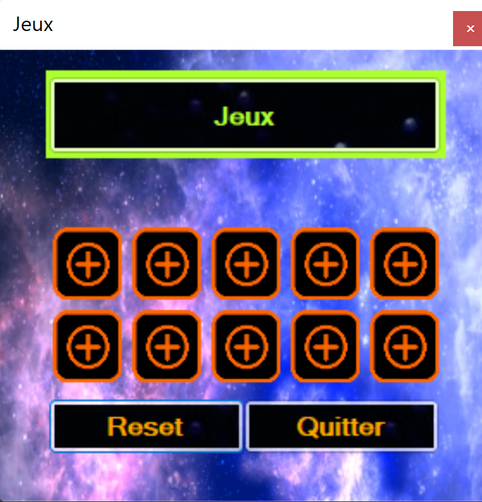

<h1 align="center">
  
</h1>

---

# JEUX DE MOT

## Petit résumé
- Il est parfois gérer tout les logiciels de son ordinateurs

## Objectifs
- Créer une application qui gére les applications d'un ordinateur

## Techno
- VB.Net
- Visual Studio

## UI

## Auteur
- [@Pierre](https://github.com/Pierre-Portfolio)
